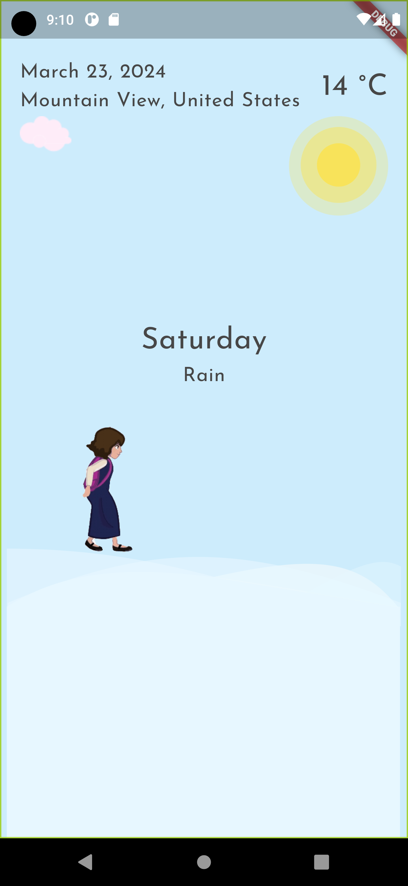

🌦️ **Flutter Weather App**

**Project Description**

This Flutter application offers a user-friendly experience for checking current weather conditions based on your device's location. It retrieves weather data dynamically, ensuring up-to-date information.

**Features**

📍 Location-Aware Weather Display: The app automatically retrieves your device's location and displays relevant weather data.

🌡️ Essential Weather Details: It presents current temperature, weather icon, and the date for a quick and clear overview.

🔄 Seamless Updates: The app refreshes weather information in the background, keeping you informed of changing conditions.

**Installation**

**Clone the Repository:** Open your terminal and execute the following command to clone the project from GitHub:

```bash
git clone https://github.com/mehuldadlani/weather_app.git
```

Use code with caution.

**Navigate to Project Directory:** Use the `cd` command to navigate to the newly cloned directory:

```bash
cd weather_app
```

Use code with caution.

**Install Dependencies:** Install the required packages using the Flutter package manager:

```bash
flutter pub get
```

Use code with caution.

**Run the App:** Launch the app on your preferred device (physical or simulator) using the Flutter command-line tool:

```bash
flutter run
```

Use code with caution.

**Usage**

**Location Permission:** Upon launching the app, it might request permission to access your device's location. Granting permission is necessary for the app to function correctly.

**Weather Display:** Once location access is granted, the app fetches weather data and presents it on the screen.

**Background Updates:** The app continues to retrieve and display weather updates in the background.

**Dependencies**

This project relies on the following Flutter packages:

- `provider`: Facilitates state management within the app.
- `geolocator`: Empowers retrieval of your device's location data.
- `geocoding`: Enables conversion of geographical coordinates to human-readable location names.
- `google_fonts`: Provides access to various Google Fonts for customizable text styling.

For more details about these dependencies, refer to the `pubspec.yaml` file within the project directory.

**Contributing**

We welcome contributions to this project! Encountering bugs or having ideas for improvement? Feel free to open an issue or submit a pull request to collaborate.

**License**

This project is distributed under the permissive MIT License, providing flexibility for reuse and modification.

**Screenshot**




